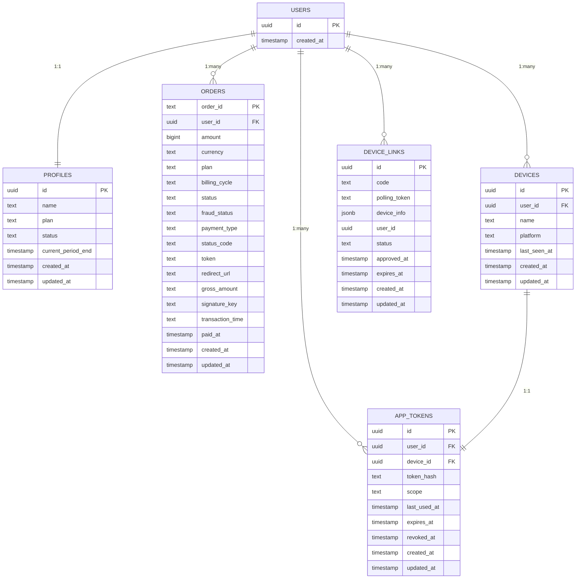

# Ternary Website Database Schema Documentation

## Overview

The Ternary website uses Supabase (PostgreSQL) as its primary database with a schema designed to support user management, billing, device linking, and application data. The schema implements Row Level Security (RLS) to ensure data isolation between users.

## Core Concepts

### User Management
- **Profiles**: User profile information and subscription status
- **Authentication**: Managed by Supabase Auth with email/password and OAuth

### Billing System
- **Orders**: Payment records and transaction history
- **Subscriptions**: Recurring billing information (if applicable)

### Device Management
- **Devices**: Registered desktop applications
- **Device Links**: Temporary linking requests between desktop and web
- **App Tokens**: Authentication tokens for device API access

### Application Data
- **App Metadata**: Information about user's Ternary applications
- **Usage Tracking**: API usage and feature utilization

## Schema Diagram



## Table Definitions

### Profiles

User profile information and subscription status.

```sql
create table public.profiles (
  id uuid primary key references auth.users(id) on delete cascade,
  name text,
  plan text default 'free',
  status text default 'inactive', -- active | pending | inactive
  current_period_end timestamptz,
  created_at timestamptz default now(),
  updated_at timestamptz default now()
);
```

**Columns**:
- `id`: User ID (foreign key to auth.users)
- `name`: User's display name
- `plan`: Subscription plan (free, pro, team)
- `status`: Account status (active, pending, inactive)
- `current_period_end`: End of current billing period
- `created_at`: Record creation timestamp
- `updated_at`: Record last update timestamp

**Indexes**:
- Primary key on `id`

**Triggers**:
- `set_profiles_updated_at`: Updates `updated_at` on record changes

**Row Level Security**:
- Users can read their own profile
- Users can insert their own profile
- Users can update their own profile

### Orders

Payment and billing records.

```sql
create table public.orders (
  order_id text primary key,
  user_id uuid references auth.users(id) on delete set null,
  amount bigint not null,
  currency text not null default 'IDR',
  plan text,
  billing_cycle text,              -- monthly | annual
  status text,                     -- initiated | pending | settlement | capture | deny | expire | cancel | failure
  fraud_status text,
  payment_type text,
  status_code text,
  token text,
  redirect_url text,
  gross_amount text,
  signature_key text,
  transaction_time text,
  paid_at timestamptz,
  created_at timestamptz default now(),
  updated_at timestamptz default now()
);
```

**Columns**:
- `order_id`: Unique order identifier
- `user_id`: User who placed the order
- `amount`: Payment amount in smallest currency unit
- `currency`: Currency code (default IDR)
- `plan`: Subscription plan name
- `billing_cycle`: Billing frequency (monthly, annual)
- `status`: Payment status
- `fraud_status`: Fraud detection status
- `payment_type`: Payment method used
- `status_code`: Payment gateway status code
- `token`: Payment gateway token
- `redirect_url`: Payment page URL
- `gross_amount`: Gross payment amount
- `signature_key`: Payment signature for verification
- `transaction_time`: Payment processing timestamp
- `paid_at`: Payment completion timestamp
- `created_at`: Record creation timestamp
- `updated_at`: Record last update timestamp

**Indexes**:
- Primary key on `order_id`
- Index on `user_id` for faster lookups
- Index on `status` for status queries

**Triggers**:
- `set_orders_updated_at`: Updates `updated_at` on record changes

**Row Level Security**:
- Users can read their own orders
- Users can insert their own orders

### Devices

Registered desktop applications.

```sql
create table public.devices (
  id uuid primary key default gen_random_uuid(),
  user_id uuid references auth.users(id) on delete cascade,
  name text,
  platform text,
  last_seen_at timestamptz,
  created_at timestamptz default now(),
  updated_at timestamptz default now()
);
```

**Columns**:
- `id`: Unique device identifier
- `user_id`: Owner of the device
- `name`: Device name/description
- `platform`: Operating system (windows, mac, linux)
- `last_seen_at`: Last activity timestamp
- `created_at`: Device registration timestamp
- `updated_at`: Record last update timestamp

**Indexes**:
- Primary key on `id`

**Triggers**:
- `set_devices_updated_at`: Updates `updated_at` on record changes

**Row Level Security**:
- Users can read their own devices
- Users can update their own devices

### Device Links

Temporary linking requests between desktop app and website.

```sql
create table public.device_links (
  id uuid primary key default gen_random_uuid(),
  code text unique,
  polling_token text unique,
  device_info jsonb,
  user_id uuid,
  status text default 'pending', -- pending | confirmed | expired | revoked
  approved_at timestamptz,
  expires_at timestamptz,
  created_at timestamptz default now(),
  updated_at timestamptz default now()
);
```

**Columns**:
- `id`: Unique link identifier
- `code`: Short user-friendly code for manual entry
- `polling_token`: Long token for desktop app polling
- `device_info`: JSON metadata about the device
- `user_id`: User who confirmed the link
- `status`: Link status (pending, confirmed, expired, revoked)
- `approved_at`: Timestamp when user confirmed link
- `expires_at`: Link expiration timestamp
- `created_at`: Link creation timestamp
- `updated_at`: Record last update timestamp

**Indexes**:
- Primary key on `id`
- Unique index on `code`
- Unique index on `polling_token`

**Triggers**:
- `set_device_links_updated_at`: Updates `updated_at` on record changes

**Row Level Security**:
- No RLS (handled by service role for device linking)

### App Tokens

Authentication tokens for device API access.

```sql
create table public.app_tokens (
  id uuid primary key default gen_random_uuid(),
  user_id uuid not null references auth.users(id) on delete cascade,
  device_id uuid not null references public.devices(id) on delete cascade,
  token_hash text not null,
  scope text,
  last_used_at timestamptz,
  expires_at timestamptz,
  revoked_at timestamptz,
  created_at timestamptz default now(),
  updated_at timestamptz default now()
);
```

**Columns**:
- `id`: Unique token identifier
- `user_id`: Token owner
- `device_id`: Associated device
- `token_hash`: Hashed token value (never store plain tokens)
- `scope`: Token permissions
- `last_used_at`: Last token usage timestamp
- `expires_at`: Token expiration timestamp
- `revoked_at`: Token revocation timestamp
- `created_at`: Token creation timestamp
- `updated_at`: Record last update timestamp

**Indexes**:
- Primary key on `id`
- Index on `user_id` for user queries
- Index on `device_id` for device queries
- Index on `token_hash` for token validation

**Triggers**:
- `set_app_tokens_updated_at`: Updates `updated_at` on record changes

**Row Level Security**:
- Users can read their own tokens

## Row Level Security Policies

### Profiles
```sql
-- Users can read their own profile
create policy "profiles self read" on public.profiles
for select using (auth.uid() = id);

-- Users can insert their own profile
create policy "profiles self insert" on public.profiles
for insert with check (auth.uid() = id);

-- Users can update their own profile
create policy "profiles self update" on public.profiles
for update using (auth.uid() = id);
```

### Orders
```sql
-- Users can read their own orders
create policy "orders self read" on public.orders
for select using (auth.uid() = user_id);

-- Users can insert their own orders
create policy "orders self insert" on public.orders
for insert with check (auth.uid() = user_id);
```

### Devices
```sql
-- Users can read their own devices
create policy "devices self read" on public.devices
for select using (auth.uid() = user_id);

-- Users can update their own devices
create policy "devices self update" on public.devices
for update using (auth.uid() = user_id);
```

### App Tokens
```sql
-- Users can read their own tokens
create policy "app_tokens self read" on public.app_tokens
for select using (auth.uid() = user_id);
```

## Extensions Used

### moddatetime
Used for automatically updating timestamp columns:

```sql
create extension if not exists moddatetime;
```

This extension provides the `moddatetime` trigger function that automatically updates specified timestamp columns when a row is modified.

## Migration Files

Database schema changes are managed through migration files in `supabase/migrations/`:

1. `20250905110000_orders_profiles.sql` - Initial profiles and orders tables
2. `20250905111500_fix_orders_gateway.sql` - Fixes to orders table
3. `20250905123000_linking.sql` - Device linking schema
4. `20250905123500_link_fallback.sql` - Linking fallback mechanisms

## Security Considerations

### Data Encryption
- Sensitive data is encrypted at rest
- Authentication tokens are hashed before storage
- SSL/TLS encryption for all database connections

### Access Control
- Row Level Security enforces data isolation
- Service role used for specific operations (device linking)
- Authentication required for all data access

### Audit Trail
- All tables include `created_at` and `updated_at` timestamps
- User actions are logged through application code
- Payment transactions are recorded for audit purposes

### Data Retention
- User data retained as long as account exists
- Payment records retained for legal/compliance purposes
- Inactive accounts may be archived after extended periods

## Performance Optimizations

### Indexing Strategy
- Primary keys on all tables
- Foreign key indexes for relationship queries
- Composite indexes for complex queries
- Unique indexes for constraints

### Query Optimization
- Efficient join strategies
- Proper use of WHERE clauses
- Pagination for large result sets
- Caching of frequently accessed data

### Connection Management
- Connection pooling for efficient resource usage
- Proper transaction management
- Timeout settings to prevent hanging queries

This database schema documentation provides a comprehensive overview of the Ternary website's data structure, relationships, and security measures.