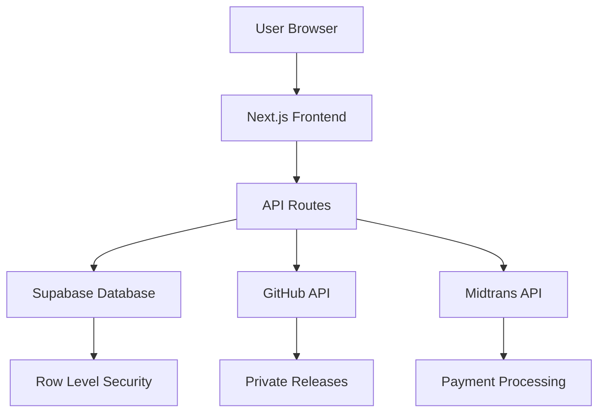
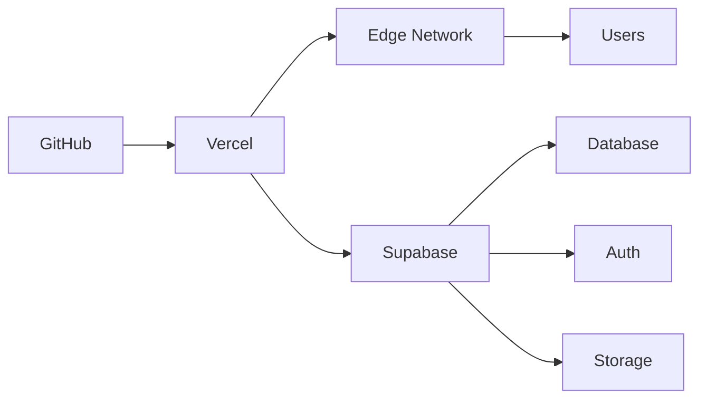

# Ternary Website Technical Deep Dive

## System Architecture

The Ternary website follows a modern web application architecture with a clear separation of concerns:

### Frontend Architecture

- **Framework**: Next.js 15 with App Router
- **Rendering**: Server-side rendering (SSR) and static site generation (SSG)
- **Styling**: Tailwind CSS with custom design system
- **Components**: shadcn/ui component library with Radix UI primitives
- **State Management**: React built-in state and hooks
- **Animations**: Framer Motion for smooth transitions

### Backend Architecture

- **API Layer**: Next.js serverless functions (API routes)
- **Database**: Supabase (PostgreSQL with built-in auth)
- **Authentication**: Supabase Auth with session management
- **Payments**: Midtrans integration for Indonesian market
- **File Storage**: Supabase Storage for assets
- **Caching**: Edge caching for API responses

### Data Flow Architecture



## Core Systems

### 1. GitHub Release Proxy System

#### Components

- **Release API** (`/api/releases`) - Fetches and formats GitHub releases
- **Download Proxy** (`/api/download`) - Securely streams private assets
- **Platform Detection** (`lib/platform.ts`) - Client-side OS/arch detection
- **UI Components** - Instant download buttons and release browsers

#### Technical Implementation

The release proxy system solves several key problems:

1. **Token Security**: GitHub tokens never reach the client
2. **Private Asset Access**: Users can download private releases without GitHub accounts
3. **Platform Awareness**: Automatic asset recommendation based on user's OS
4. **Performance**: Caching and streaming optimizations

#### API Flow

```typescript
// /api/releases
async function GET() {
  // 1. Fetch releases from GitHub API
  const releases = await fetch(`https://api.github.com/repos/${OWNER}/${REPO}/releases`, {
    headers: { Authorization: `Bearer ${TOKEN}` }
  });
  
  // 2. Transform and proxy download URLs
  const shaped = releases.map(release => ({
    ...release,
    assets: release.assets.map(asset => ({
      ...asset,
      download_url: `/api/download?asset_id=${asset.id}`
    }))
  }));
  
  return NextResponse.json({ stable, beta });
}

// /api/download
async function GET(req: NextRequest) {
  const assetId = req.nextUrl.searchParams.get("asset_id");
  
  // 1. Get signed URL from GitHub
  const head = await fetch(`https://api.github.com/repos/${OWNER}/${REPO}/releases/assets/${assetId}`, {
    headers: { Authorization: `Bearer ${TOKEN}` },
    redirect: "manual"
  });
  
  // 2. Stream asset to client
  const location = head.headers.get("location");
  const fileResp = await fetch(location);
  
  return new Response(fileResp.body, { 
    status: 200,
    headers: fileResp.headers
  });
}
```

#### Platform Detection

```typescript
export function detectPlatform(): { os: OS | null; arch: Arch } {
  if (typeof navigator === "undefined") return { os: null, arch: null };
  
  const ua = navigator.userAgent.toLowerCase();
  const platform = (navigator.platform || "").toLowerCase();

  // OS Detection
  let os: OS | null = null;
  if (ua.includes("windows")) os = "windows";
  else if (ua.includes("mac os") || ua.includes("macintosh")) os = "mac";
  else if (ua.includes("linux")) os = "linux";

  // Architecture Detection
  let arch: Arch = null;
  if (ua.includes("arm64") || ua.includes("aarch64")) arch = "arm64";
  else if (ua.includes("x86_64") || ua.includes("win64")) arch = "x64";

  return { os, arch };
}
```

### 2. Authentication System

#### Supabase Integration

The authentication system uses Supabase Auth with:

- **Email/Password** authentication
- **OAuth Providers** (Google, GitHub)
- **Session Management** with automatic refresh
- **Row Level Security** for data protection

#### Database Schema

```sql
-- User profiles
create table public.profiles (
  id uuid primary key references auth.users(id) on delete cascade,
  name text,
  plan text default 'free',
  status text default 'inactive',
  current_period_end timestamptz,
  created_at timestamptz default now(),
  updated_at timestamptz default now()
);

-- Row Level Security Policies
create policy "profiles self read" on public.profiles
for select using (auth.uid() = id);

create policy "profiles self update" on public.profiles
for update using (auth.uid() = id);
```

#### Client-Side Authentication

```typescript
// lib/supabase-browser.ts
export function getSupabaseBrowser() {
  const url = process.env.NEXT_PUBLIC_SUPABASE_URL;
  const anon = process.env.NEXT_PUBLIC_SUPABASE_ANON_KEY;
  return createClient(url, anon);
}

// app/login/page.tsx
const handleSubmit = async (e: React.FormEvent) => {
  e.preventDefault();
  const supabase = getSupabaseBrowser();
  const { error } = await supabase.auth.signInWithPassword({ email, password });
  if (!error) router.push("/");
};
```

### 3. Device Linking System

#### Components

- **Link Initialization** (`/api/link/init`) - Generate short codes
- **Link Confirmation** (`/api/link/confirm`) - User verification
- **Link Approval** (`/api/link/approve`) - Desktop app polling
- **Device Management** (`/api/devices/*`) - CRUD operations

#### Database Schema

```sql
-- Device linking requests
create table public.device_links (
  id uuid primary key default gen_random_uuid(),
  code text unique,                    -- Short user-friendly code
  polling_token text unique,           -- Long token for desktop polling
  device_info jsonb,                   -- Device metadata
  user_id uuid,                        -- Linked user (when confirmed)
  status text default 'pending',       -- pending | confirmed | expired
  approved_at timestamptz,             -- When user confirmed
  expires_at timestamptz,              -- Expiration timestamp
  created_at timestamptz default now()
);

-- Linked devices
create table public.devices (
  id uuid primary key default gen_random_uuid(),
  user_id uuid references auth.users(id) on delete cascade,
  name text,                           -- Device name
  platform text,                       -- OS platform
  last_seen_at timestamptz,            -- Last activity timestamp
  created_at timestamptz default now()
);

-- API tokens for devices
create table public.app_tokens (
  id uuid primary key default gen_random_uuid(),
  user_id uuid not null references auth.users(id) on delete cascade,
  device_id uuid not null references public.devices(id) on delete cascade,
  token_hash text not null,            -- Hashed token for security
  scope text,                          -- Token permissions
  last_used_at timestamptz,            -- Last usage timestamp
  expires_at timestamptz,              -- Expiration timestamp
  revoked_at timestamptz,              -- Revocation timestamp
  created_at timestamptz default now()
);
```

#### Linking Flow Implementation

```typescript
// lib/linking.ts
export function generateShortCode(len = 6) {
  const alphabet = "ABCDEFGHJKLMNPQRSTUVWXYZ23456789"; // no 0/O/1/I
  let s = "";
  const bytes = crypto.randomBytes(len);
  for (let i = 0; i < len; i++) s += alphabet[bytes[i] % alphabet.length];
  return s;
}

export function generatePollingToken() {
  return crypto.randomBytes(24).toString("base64url");
}

// /api/link/init/route.ts
export async function POST(req: Request) {
  const body = await req.json();
  const { device_name, platform, app_version } = body;
  
  const code = generateShortCode(6);
  const polling_token = generatePollingToken();
  const expires_at = new Date(Date.now() + 10 * 60 * 1000).toISOString();
  
  // Store linking request
  const { error } = await supa.from("device_links").insert({
    code,
    polling_token,
    device_info: { device_name, platform, app_version },
    status: "pending",
    expires_at,
  });
  
  return NextResponse.json({ 
    code, 
    polling_token, 
    verify_url: `${origin}/link/verify?code=${code}`,
    expires_at 
  });
}
```

### 4. Payment System

#### Midtrans Integration

The payment system uses Midtrans Snap API for secure payment processing:

- **Transaction Creation** - Server-side transaction initialization
- **Secure Checkout** - Client-side payment popup
- **Webhook Handling** - Server-side payment notifications
- **Order Management** - Database record keeping

#### Payment Flow Implementation

```typescript
// lib/midtrans.ts
export async function startSnapCheckout(input: SnapCheckoutInput) {
  // 1. Load Midtrans Snap.js library
  await loadSnapScript(clientKey, env);
  
  // 2. Create transaction on server
  const res = await fetch("/api/payments/midtrans/create", {
    method: "POST",
    headers: { "Content-Type": "application/json" },
    body: JSON.stringify(input),
  });
  
  const json = await res.json();
  const token = json.token;
  
  // 3. Open payment popup
  window.snap?.pay(token, {
    onSuccess: (result) => console.log("Payment success", result),
    onError: (error) => alert("Payment failed"),
    onClose: () => console.log("Payment popup closed")
  });
}

// /api/payments/midtrans/create/route.ts
export async function POST(req: Request) {
  const body = await req.json();
  const { amount, items, customer, metadata } = body;
  
  // 1. Create Midtrans transaction
  const payload = {
    transaction_details: {
      order_id: makeOrderId("plan"),
      gross_amount: Math.round(amount),
    },
    credit_card: { secure: true },
    item_details: items?.map((it: any, idx: number) => ({
      id: it.id || `item-${idx + 1}`,
      price: Math.round(it.price),
      quantity: it.quantity,
      name: it.name,
    })),
    customer_details: customer,
    custom_field1: JSON.stringify(metadata).slice(0, 128)
  };
  
  const res = await fetch(`${baseUrl}/snap/v1/transactions`, {
    method: "POST",
    headers: {
      "Content-Type": "application/json",
      "Accept": "application/json",
      "Authorization": "Basic " + Buffer.from(`${serverKey}:`).toString("base64"),
    },
    body: JSON.stringify(payload),
  });
  
  const json = await res.json();
  
  // 2. Record order in database
  const { error: dbError } = await supa.from("orders").insert({
    order_id: finalOrderId,
    user_id: metadata?.user_id,
    amount,
    currency: "IDR",
    plan: metadata?.plan || null,
    billing_cycle: metadata?.billing_cycle || null,
    status: "initiated",
    token: json.token,
    redirect_url: json.redirect_url,
  });
  
  return NextResponse.json({
    token: json.token,
    redirect_url: json.redirect_url,
    order_id: finalOrderId,
  });
}
```

## Performance Optimizations

### 1. Caching Strategies

- **API Response Caching** - Edge caching for static content
- **Database Query Optimization** - Indexed queries and efficient joins
- **Image Optimization** - Next.js Image component with automatic optimization
- **Code Splitting** - Dynamic imports for reduced bundle sizes

### 2. Security Measures

- **CORS Protection** - Controlled API access
- **Rate Limiting** - API request throttling
- **Input Validation** - Server-side validation and sanitization
- **Token Security** - Hashed tokens and secure storage

### 3. Error Handling

- **Graceful Degradation** - Fallback UI for failed operations
- **Error Boundaries** - React error boundaries for component failures
- **Logging** - Comprehensive error logging for debugging
- **User Feedback** - Clear error messages and recovery options

## Deployment Architecture

### Vercel Deployment



### Environment Configuration

```bash
# Production Environment Variables
NEXT_PUBLIC_SUPABASE_URL=https://your-project.supabase.co
NEXT_PUBLIC_SUPABASE_ANON_KEY=your-anon-key
SUPABASE_SERVICE_ROLE_KEY=your-service-role-key
GITHUB_OWNER=ternarystudioai-code
GITHUB_REPO=ternary
GITHUB_TOKEN=ghp_your_token
NEXT_PUBLIC_MIDTRANS_CLIENT_KEY=your-client-key
MIDTRANS_SERVER_KEY=your-server-key
MIDTRANS_ENV=production
```

## Monitoring and Maintenance

### Health Checks

- **API Endpoint Monitoring** - Uptime and response time tracking
- **Database Performance** - Query performance and connection pooling
- **Payment Processing** - Transaction success rates and error tracking
- **User Experience** - Page load times and interaction metrics

### Database Maintenance

- **Regular Backups** - Automated database snapshots
- **Index Optimization** - Query performance analysis and optimization
- **Schema Migrations** - Version-controlled database changes
- **Data Archiving** - Old data cleanup and archiving

### Security Updates

- **Dependency Updates** - Regular package updates and security patches
- **Vulnerability Scanning** - Automated security scanning
- **Access Control Reviews** - Regular permission audits
- **Penetration Testing** - Periodic security assessments

This technical deep dive provides a comprehensive overview of the Ternary website's architecture, implementation details, and operational considerations.