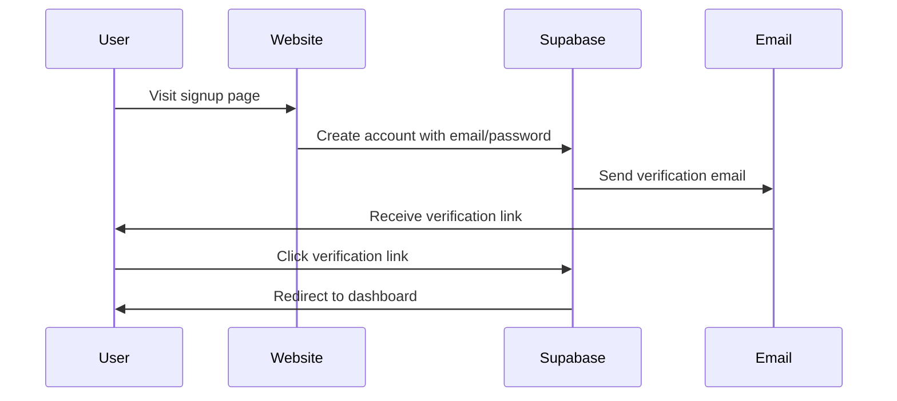
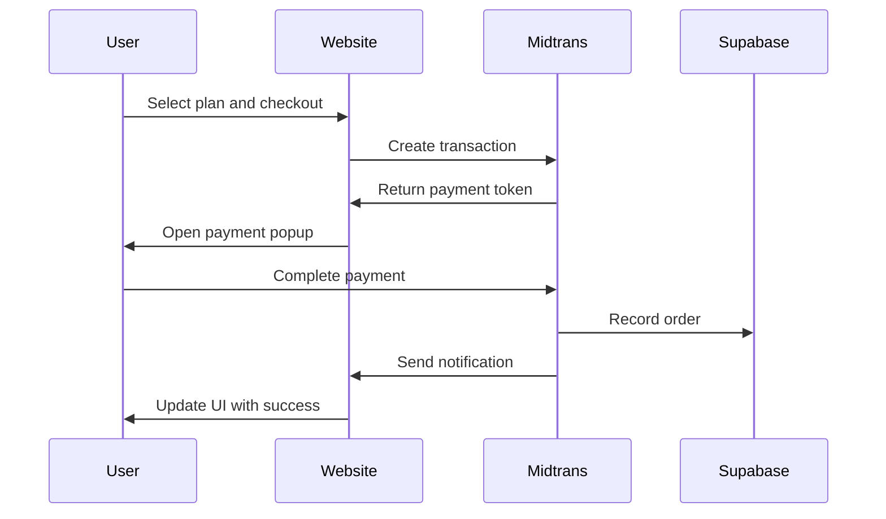
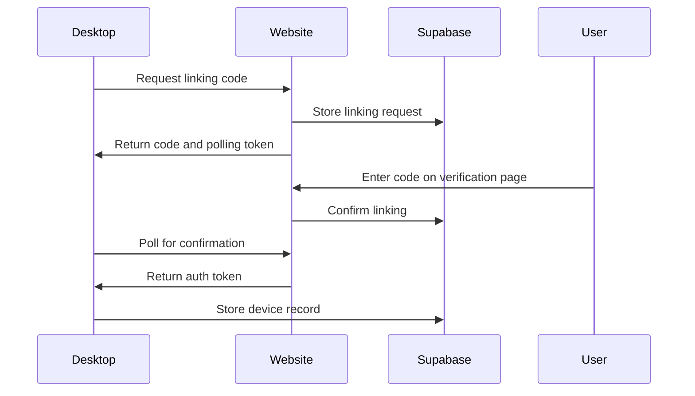

# Ternary Website Documentation

## Overview

The Ternary website is a Next.js application that serves as the marketing and download portal for the Ternary desktop application. It provides:

1. **Marketing Pages** - Homepage, features, pricing, testimonials, and FAQ
2. **Download System** - Secure proxy for GitHub releases with platform detection
3. **User Authentication** - Supabase-powered login/signup with dashboard
4. **Billing System** - Payment processing with Midtrans integration
5. **Device Linking** - Connection between website accounts and desktop app

## Project Structure

```
website/
├── app/                    # Next.js app directory
│   ├── api/               # API routes
│   ├── dashboard/         # User dashboard pages
│   ├── downloads/         # Download pages
│   ├── login/             # Login page
│   ├── signup/            # Signup page
│   └── page.tsx           # Homepage
├── components/            # React components
├── lib/                   # Utility libraries
├── public/                # Static assets
├── supabase/              # Supabase configuration
└── styles/                # CSS styles
```

## Core Features

### 1. GitHub Release Proxy System

The website provides a secure proxy for downloading Ternary releases from a private GitHub repository:

#### API Endpoints

- `GET /api/releases` - Fetches releases from GitHub and proxies download URLs
- `GET /api/download?asset_id=123` - Streams assets from GitHub without exposing tokens

#### Security Features

- Server-side GitHub token management
- Asset download proxying to prevent token exposure
- Signed URLs for private asset access

#### Platform Detection

- Client-side OS/arch detection
- Automatic asset recommendation based on platform
- Instant download buttons for user's platform

### 2. User Authentication System

Powered by Supabase Auth with:

#### Authentication Methods

- Email/password signup and login
- OAuth with Google and GitHub
- Session management with automatic refresh
- Protected dashboard routes

#### Database Schema

- `profiles` - User profile information
- `orders` - Payment and billing records
- `devices` - Linked desktop applications
- `device_links` - Temporary linking codes
- `app_tokens` - API tokens for device authentication

### 3. Billing and Payments

Integrated with Midtrans payment gateway:

#### Payment Flow

1. User selects plan and billing cycle
2. Website creates transaction with Midtrans API
3. Redirects to secure payment page
4. Handles success/pending/error callbacks
5. Records orders in Supabase database

#### Plan Structure

- **Starter** - Free tier with limited features
- **Pro** - $29/month or $24/month (annual)
- **Team** - $99/month or $79/month (annual)

### 4. Device Linking System

Connects desktop app with website account:

#### Linking Flow

1. Desktop app requests linking code from website
2. User enters code on website verification page
3. Website confirms link and creates device record
4. Desktop app receives authentication token

#### Security Features

- Short-lived linking codes (10 minutes)
- One-time use codes
- Device revocation capability
- Token-based authentication

## Technical Architecture

### Frontend

- **Framework**: Next.js 15 with App Router
- **Styling**: Tailwind CSS with custom themes
- **Components**: shadcn/ui with Radix UI primitives
- **Animations**: Framer Motion
- **State Management**: React hooks and built-in state

### Backend

- **API Routes**: Next.js serverless functions
- **Database**: Supabase (PostgreSQL with Row Level Security)
- **Authentication**: Supabase Auth
- **Payments**: Midtrans Snap API
- **File Storage**: Supabase Storage (for assets)

### Security

- **CORS**: Controlled API access
- **RLS**: Row Level Security for database records
- **Token Management**: Secure storage of API keys
- **HTTPS**: All connections secured with TLS

## Key Components

### Homepage (`app/page.tsx`)

- Responsive design with mobile navigation
- Platform-aware instant download buttons
- Feature sections with smooth scrolling
- Social proof with company logos

### Download Page (`app/downloads/page.tsx`)

- Release browsing for stable and beta versions
- Platform-specific asset recommendations
- Direct download links through proxy
- Release notes display

### Dashboard (`app/dashboard/page.tsx`)

- User profile information
- Billing history and orders
- Device management with revocation
- API token management (planned)

### Authentication Pages

- **Login** (`app/login/page.tsx`) - Email/password and OAuth
- **Signup** (`app/signup/page.tsx`) - Account creation with email verification

## API Routes

### Release Management

- `/api/releases` - Fetch and format GitHub releases
- `/api/download` - Proxy asset downloads

### User Management

- `/api/link/init` - Generate device linking codes
- `/api/link/confirm` - Confirm device links
- `/api/link/approve` - Approve device linking requests
- `/api/link/status` - Check linking status

### Payment Processing

- `/api/payments/midtrans/create` - Create Midtrans transactions
- `/api/payments/midtrans/notify` - Handle payment notifications

### Device Management

- `/api/devices/list` - List user's devices
- `/api/devices/revoke` - Revoke device tokens

## Data Flow

### User Registration



### Payment Processing



### Device Linking



## Environment Variables

### Required Variables

```bash
# Supabase Configuration
NEXT_PUBLIC_SUPABASE_URL=your-supabase-url
NEXT_PUBLIC_SUPABASE_ANON_KEY=your-anon-key
SUPABASE_SERVICE_ROLE_KEY=your-service-role-key

# GitHub Release Proxy
GITHUB_OWNER=your-github-org
GITHUB_REPO=your-repo-name
GITHUB_TOKEN=your-github-token

# Midtrans Payments
NEXT_PUBLIC_MIDTRANS_CLIENT_KEY=your-client-key
MIDTRANS_SERVER_KEY=your-server-key
MIDTRANS_ENV=sandbox|production
```

## Deployment

### Hosting Options

- **Vercel** - Recommended with zero-config deployment
- **Self-hosted** - Node.js server with reverse proxy

### Supabase Setup

1. Create Supabase project
2. Run database migrations from `supabase/migrations/`
3. Configure authentication providers
4. Set up Row Level Security policies

### GitHub Integration

1. Create GitHub Personal Access Token
2. Grant read access to releases and assets
3. Configure repository owner and name
4. Test API endpoints

## Future Enhancements

### Planned Features

- Enhanced analytics and usage tracking
- Advanced API token management
- Team collaboration features
- Custom domain support
- Webhook integrations

### Research Areas

- Progressive Web App support
- Enhanced device management
- Advanced billing features
- Integration with more payment providers